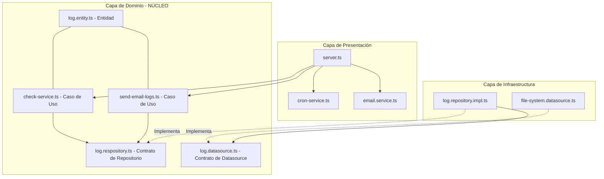
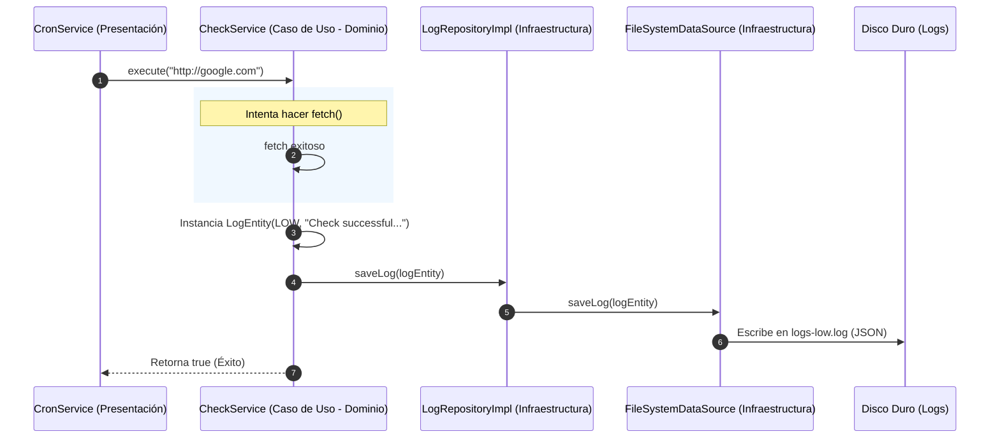

# Proyecto NOC (Network Operations Center)

Este proyecto tiene como objetivo crear un sistema de monitoreo de servicios (NOC) utilizando **Arquitectura Limpia (Clean Architecture)** con TypeScript.

---

## 🛠️ Arquitectura Limpia Aplicada

Este proyecto está estructurado siguiendo la **Regla de Dependencia**: *las dependencias de código solo pueden apuntar hacia adentro*, es decir, hacia el núcleo de la aplicación (el Dominio). 
* **El Dominio no sabe nada de bases de datos, frameworks ni librerías de terceros.**
* Las bases de datos, servicios de correo y librerías externas se ubican en la periferia (Infraestructura o Presentación) y se conectan al núcleo mediante contratos (Interfaces).

### 🗺️ Mapa de Capas del Proyecto



---

### 📂 Desglose Detallado de las Capas

#### 1. 🎯 Capa de Dominio (Domain)
Es el corazón de la aplicación. Contiene las reglas de negocio puras. No tiene dependencias de librerías externas (como nodemailer, mongodb, etc.).

*   **Entidades (`src/domain/entities/log.entity.ts`):** Define el objeto de negocio `LogEntity`, que representa cómo es un log en nuestro sistema (mensaje, nivel de severidad, fecha de creación y origen).
*   **Contratos/Interfaces (`src/domain/datasources/` y `src/domain/repository/`):** Define *qué* acciones se pueden realizar con los logs (guardar, obtener), pero no *cómo* se guardan.
    *   `LogDataSource`: Contrato para el origen de datos.
    *   `LogRepository`: Contrato para el repositorio de logs que interactuará con el Caso de Uso.
*   **Casos de Uso (`src/domain/use-cases/`):** Representan las acciones del negocio.
    *   `CheckService`: Su única tarea es hacer un `fetch` a una URL. Si funciona, crea un log de nivel `LOW` y ejecuta un callback exitoso; si falla, crea un log de nivel `HIGH` y ejecuta un callback de error.
    *   `SendEmailLogs`: Su única tarea es enviar los archivos de logs adjuntos por correo y guardar un log de auditoría confirmando el envío.

#### 2. 🔌 Capa de Infraestructura (Infrastructure)
Implementa los contratos del Dominio usando tecnologías específicas. Si mañana decidimos cambiar de guardar archivos de texto local a una base de datos en MongoDB o PostgreSQL, **solo modificamos esta capa**, el Dominio permanece intacto.

*   **Datasources (`src/infrastructure/datasources/file-system.datasource.ts`):** Implementación técnica real. En este caso, lee y escribe archivos de texto plano divididos por niveles (`logs-low.log`, `logs-medium.log`, `logs-high.log`).
*   **Repositories (`src/infrastructure/repositories/log.repository.impl.ts`):** Actúa como un puente. Recibe el datasource y llama a sus métodos. Cumple con la interfaz definida en el Dominio (`LogRepository`).

#### 3. 🖥️ Capa de Presentación (Presentation)
Es el punto de entrada de la aplicación. Maneja el "cómo" se expone la aplicación al mundo (ej. consola, HTTP server, cron jobs).

*   **Server (`src/presentation/server.ts`):** Orquestador de la aplicación. Configura e inicializa los servicios.
*   **Cron Service (`src/presentation/cron/cron-service.ts`):** Wrapper de la librería externa `cron` para ejecutar procesos recurrentes cada $N$ segundos.
*   **Email Service (`src/presentation/email/email.service.ts`):** Servicio que envuelve la librería `nodemailer` para conectarse a un servidor SMTP de correo y enviar emails.

---

### 🔄 Flujo de Ejecución (Monitoreo de Servicios)

El siguiente diagrama de secuencia ilustra el flujo de datos completo cuando el Cron Job se activa para revisar una URL:



---

### 💎 Beneficios de esta Estructura en `node-noc`

1.  **Independencia de la Base de Datos:** Actualmente usamos archivos de texto (`FileSystemDataSource`). Si queremos usar MongoDB, simplemente creamos un `MongoDataSource` que implemente `LogDataSource` y lo inyectamos en el servidor. **No hay que tocar una sola línea de código del caso de uso `CheckService`.**
2.  **Facilidad de Pruebas Unitarias (Testability):** Al utilizar inyección de dependencias a través de interfaces, podemos simular (mockear) fácilmente el repositorio de logs y probar el caso de uso `CheckService` sin escribir archivos reales en el disco.
3.  **Desacoplamiento:** Los servicios externos como Nodemailer (`EmailService`) o Cron (`CronService`) están aislados tras adaptadores de presentación. Si se desea cambiar la librería de Cron o usar SendGrid en vez de Nodemailer, el impacto es localizado y mínimo.

---

## 🚀 Desarrollo (Dev)

Sigue estos pasos para levantar el entorno de desarrollo local:

1. Crea un nuevo archivo `.env` en la raíz del proyecto.
2. Configura las variables de entorno siguiendo la siguiente estructura:

```env
PORT=3000
MAILER_EMAIL=
MAILER_SECRET_KEY=

PROD=false
```

3. Instala las dependencias y corre el proyecto:
```bash
npm install
npm run dev
```